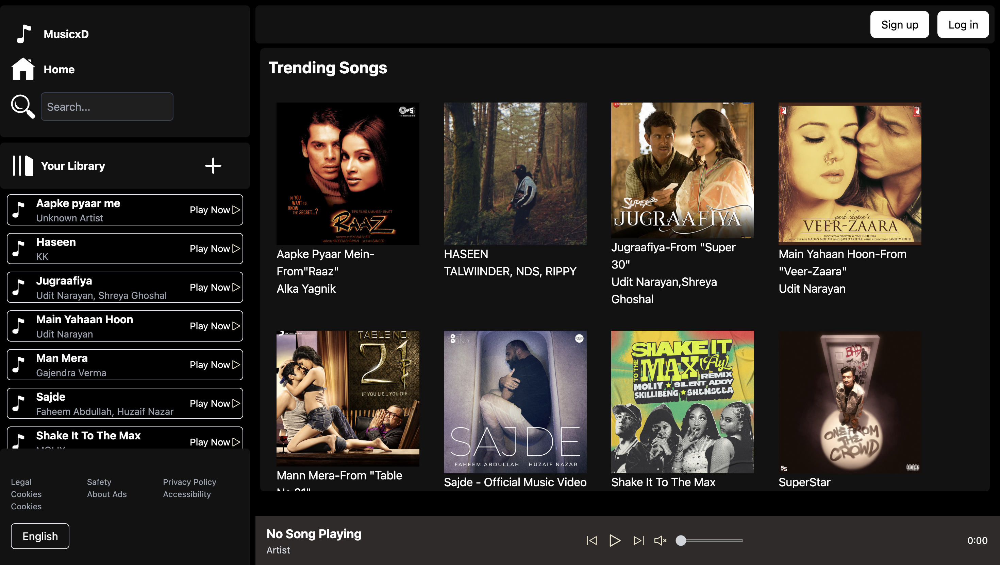

# 🎵 MusicxD – A Beautiful Music Player Web App

MusicxD is a simple yet elegant music player web app where you can play songs, view trending tracks, and enjoy a Spotify-inspired interface.



## 🚀 Features
- Browse trending songs with album covers
- Sidebar playlist with quick Play Now buttons
- Music playback controls (play, pause, skip)
- Responsive dark-themed UI

## 🛠️ Tech Stack
- HTML, CSS, JavaScript

## 🧑‍💻 How to Run
1. Clone the repo  
```bash
git clone https://github.com/codewithyasu/Music_player.git
